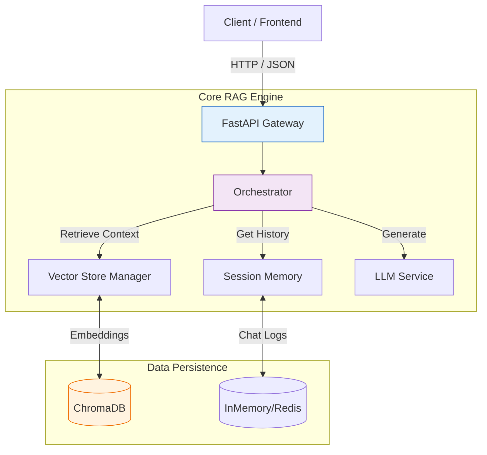

<div align="center">

# TheUltimateRAG 🚀

**The Modular, Production-Ready Foundation for Next-Gen AI Applications**

[](https://www.python.org/downloads/release/python-3100/)
[](https://fastapi.tiangolo.com)
[](https://www.langchain.com)
[](https://opensource.org/licenses/MIT)

[Features](#-key-features) •
[Architecture](#-system-architecture) •
[Installation](#-getting-started) •
[Visualizer](#-rag-visualizer-gui) •
[API](#-api-endpoints) •
[Contributing](#-contributing)

</div>

---

## 📖 Overview

**TheUltimateRAG** is not just another tutorial; it's a robust boilerplate designed for real-world application. It bridges the gap between simple tutorials and enterprise requirements by offering native **Multi-User Isolation**, **Organizational Memory**, and **Session Hierarchies**.

Whether you are building a corporate knowledge base, a legal assistant, or a personal second brain, TheUltimateRAG provides the secure and scalable backend you need.

---

## 🌟 Key Features

| Feature | Description |
| :--- | :--- |
| **⚡ High-Performance API** | Built on **FastAPI** for asynchronous, concurrent request handling. |
| **🛡️ Data Isolation** | True multi-tenant support. User A's private data is invisible to User B. |
| **🏢 Common Knowledge** | Support for "Organization-wide" documents accessible to all authorized users. |
| **🧠 Smart Memory** | Session-based context window that "remembers" the conversation flow. |
| **🔍 Hybrid Search** | Powered by **ChromaDB** with advanced metadata filtering ($and/$or logic). |
| **👁️ Visual Dashboard** | **NEW!** Includes a dedicated React GUI to visualize the RAG process in real-time. |

---

## 🏗️ System Architecture

Our modular architecture ensures component replaceability. You can swap the Vector Store, LLM Provider, or Embedding Model with minimal friction.



---

## 🚀 Getting Started

### Prerequisites
*   Python 3.10+
*   Node.js & npm (for the Visualizer)
*   OpenAI API Key

### Backend Setup

1.  **Clone the repository**
    ```bash
    git clone https://github.com/Matrixxboy/TheUnltimateRAG.git
    cd TheUnltimateRAG
    ```

2.  **Install Python Dependencies**
    ```bash
    pip install -r requirements.txt
    ```

3.  **Configure Environment**
    Copy `.env.example` to `.env` and fill in your keys:
    ```ini
    OPENAI_API_KEY=sk-...
    ```

4.  **Run the Backend**
    ```bash
    uvicorn app:app --reload
    ```
    The API will be available at `http://localhost:8000`.

### 🖥️ RAG Visualizer GUI

We have included a cutting-edge React application to help you visualize the flow.

1.  **Navigate to the Visualizer**
    ```bash
    cd rag_visualizer
    ```

2.  **Install & Run**
    ```bash
    npm install
    npm run dev
    ```
    Access the dashboard at `http://localhost:5173`.

---

## 🔄 Workflows

### Ingestion Pipeline
1.  **Upload**: User sends a PDF/TXT file + Metadata (UserID, AccessLevel).
2.  **Validation**: API checks permissions.
3.  **Chunking**: Text is split into semantically meaningful chunks (RecursiveCharacterSplitter).
4.  **Embedding**: Chunks are converted to vectors (OpenAI Ada-002).
5.  **Storage**: Vectors stored in ChromaDB with metadata tags.

### Retrieval Pipeline
1.  **Query**: User asks a question.
2.  **Filter**: System constructs a filter: `(user_id == current_user) OR (access_level == 'common')`.
3.  **Search**: Finds Top-K most similar chunks respecting the filter.
4.  **Synthesis**: LLM generates an answer using the retrieved chunks as context.

---

## 📡 API Endpoints

Explore the interactive Swagger documentation at `http://localhost:8000/docs`.

*   **POST** `/api/v1/ingest`: Securely ingest documents.
*   **POST** `/api/v1/chat`: Chat with your knowledge base.
*   **GET** `/api/v1/memory/{session_id}`: Retrieve chat history.

---

## 🤝 Contributing

We welcome contributions! Please see `CONTRIBUTING.md` for details.

1.  Fork the Project
2.  Create your Feature Branch (`git checkout -b feature/AmazingFeature`)
3.  Commit your Changes (`git commit -m 'Add some AmazingFeature'`)
4.  Push to the Branch (`git push origin feature/AmazingFeature`)
5.  Open a Pull Request

---

## 🎓 Learning Resources

New to Git? Check out our [Git Education Guide](LEARN.md) included in this repo!

---

<div align="center">
Made with ❤️ by Matrixxboy
</div>
